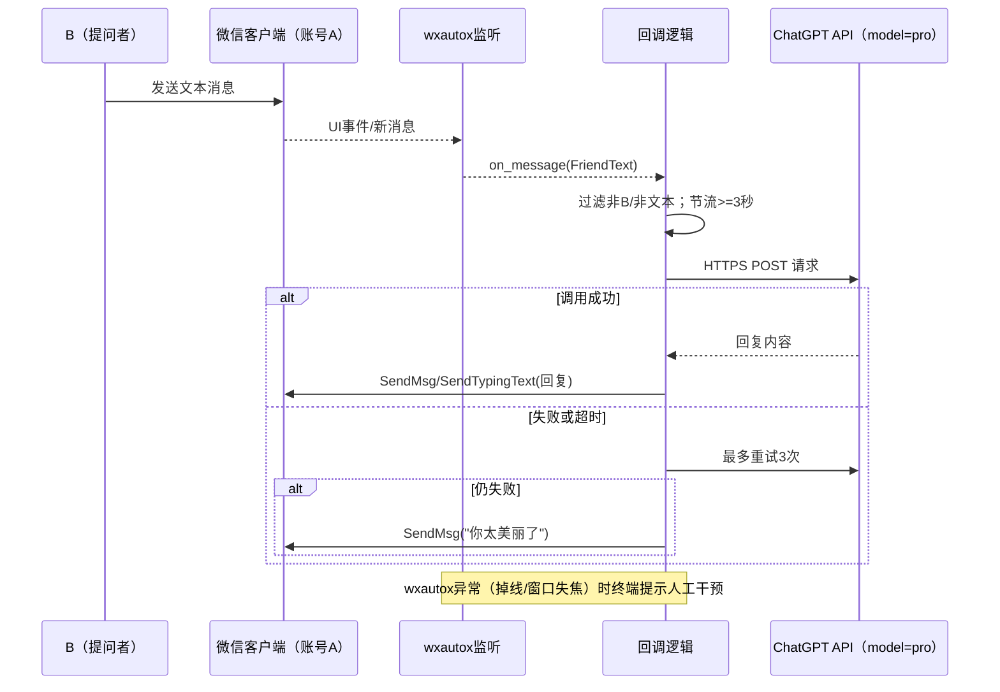

# 微信 ChatGPT 助手 - 开发文档

## 1. 项目概览
- **定位与目标**：在本地 Windows 11 上，通过 wxautox 监听微信账号 A 与指定联系人 B 的对话，将 B→A 的消息转发给 ChatGPT API 获取回答，再由 A 回复给 B。支持多轮对话（依赖模型上下文），默认使用 ChatGPT Pro。
- **非目标/范围外**：不支持群聊自动化、批量群发、朋友圈等操作；不做长时本地上下文存储；不处理除联系人 B 以外的会话。
- **主要能力**：
  - 基于 wxautox 的 UI 自动化：`WeChat.AddListenChat(nickname, callback)` 建立绑定 B 的子窗口，回调收取新消息；发送使用子窗口的 `SendMsg`/`SendTypingText`，避免误发。
  - 消息分类与过滤：仅处理单聊 B 的消息，可通过 `Chat.ChatInfo()`/`chat_type` 与消息类型判断，忽略群聊与免打扰会话。
  - 频率控制：每次回复前至少等待 3 秒，避免过快触发风控或异常。
  - 模型选择：默认 ChatGPT Pro；未来支持通过对话开头的 `#模型名字` 选择其他模型。
- **运行环境**：单机使用；操作系统 Windows 11；微信客户端（与你的账号 A 登录）；Python 3.12 + wxautox 39.1.42；网络需可访问 OpenAI API。
- **触发与交互方式**：消息触发型——当 B 发送消息给 A 时，由监听回调驱动转发与回复。无 CLI/GUI 额外交互。
- **数据与隐私**：聊天记录留在微信本身，不额外持久化；仅为个人自用，不做日志脱敏；依赖模型上下文，不维护长会话存档。
- **安全与防误发**：
  - 只创建并使用 B 的监听子窗口，发送方法的 `who` 参数对子窗口无效，降低发错会话风险。
  - 切换会话时使用 `ChatWith(who, exact=True)`，不启用 `force`，避免命中同名群聊。
  - 可选检查：在回调内读取 `chat_type` 或 ChatInfo，若检测到群聊/未知会话则直接跳过。
- **成功标准**：稳定、准确地将 B 的消息传给 API 并把回复发回 B；不中断、不错发；满足 3 秒节流；能按 `#模型名字` 指令选择模型（现阶段默认 pro）。

## 2. 架构与设计
- **系统边界**：
  - UI 自动化：wxautox 驱动本地微信客户端（账号 A 登录）。
  - 对话处理：本地 Python 进程监听指定联系人 B，调用 ChatGPT HTTP API（默认模型 pro）。
  - 交互界面：无额外 UI，仅终端日志输出。
- **关键组件与数据流**：
  1) 启动：命令行启动脚本，初始化 wxautox（授权/窗口绑定），加载配置（联系人 B、API Key、节流间隔）。
  2) 监听：`WeChat.AddListenChat(B, callback)` 建立子窗口并注册回调，`StartListening` 轮询新消息。
  3) 过滤：回调内检查 `chat_type`/`ChatInfo()`；仅处理联系人 B 的单聊文本消息，其他类型忽略。
  4) 调用模型：构造 ChatGPT API HTTP 请求（非流式），重试最多 3 次（退避策略待定）。全部失败则回复固定文案“你太美丽了”。
  5) 发送回复：在子窗口上 `SendMsg`/`SendTypingText` 发送；执行前确保距离上次回复≥3 秒（节流）。
  6) 监控/故障：wxautox 操作异常（窗口失焦/掉线）时，终端提示“人工干预”；API 异常按失败分支处理。
- **接口契约（对外/第三方）**：
  - ChatGPT API：HTTPS POST，模型固定 `pro`，非流式响应；自管重试 3 次，超出则走失败文案。
  - 微信：通过 wxautox UI 操作，无官方 API；消息读取用 `GetNextNewMessage`/监听回调，发送用 `SendMsg` 等。
- **技术选型与取舍**：
  - 直接调用 HTTP API，避免 SDK 依赖；便于控制重试与错误分支。
  - 使用 wxautox 子窗口监听 + exact 会话切换，降低误发风险；不启用 `force`。
  - 不持久化上下文，依赖模型的短时上下文；降低存储与合规复杂度。
- **性能与容量预估**：
  - 单用户、单对话，消息量低；轮询/监听间隔采用默认 1s（`WxParam.LISTEN_INTERVAL`）。
  - 节流：每次回复前至少等待 3 秒，防止过快触发风控。
- **可靠性与失败策略**：
  - API 调用：3 次重试；全失败回复“你太美丽了”作为占位。
  - wxautox/窗口异常：终端提示人工干预（重新聚焦/登录）；不中断进程可选，但建议显式提示并暂停发送。
  - 非文本消息：忽略（可选回一句“暂不支持非文本”，当前设定为直接忽略）。

### UML（时序图）
> 说明：使用 mermaid 序列图描述消息流与重试分支。

## 3. 环境与依赖
- **运行环境**：本地单机；Windows 11；微信客户端 4.1.6.14（符合 wxautox 3.9.8+ 要求）；Python 3.12。
- **Python 依赖**：使用仓库根目录的 `.venv`；核心依赖 `wxautox 39.1.42`（自带 `pywin32/comtypes/psutil/requests/tenacity` 等），无需管理员权限。
- **wxautox 授权**：若当前已能正常操控微信则无需额外操作；如遇授权报错，可通过 `python -m wxautox --export` 导出授权文件并按提示授权。
- **OpenAI 接入**：直接使用官方 HTTPS API（无代理）；模型固定 `pro`；需要可访问外网。调用由代码自管重试 3 次，失败走固定文案。
- **配置与密钥**：将 OpenAI API Key 放在本地配置文件（如 `config.yaml/json`，字段包含 `api_key`，可选 `base_url`）；避免硬编码。
- **文件与缓存**：默认运行目录为仓库根；wxautox 默认下载目录为工作目录下 `wxautox文件下载`（`WxParam.DEFAULT_SAVE_PATH`），当前仅处理文本消息，可不使用。
- **注意**：保持微信客户端在线且账号 A 登录；网络需允许访问 OpenAI API。

## 4. 本地开发与构建
- **初始化步骤**：
  - 建议使用仓库根目录的 `.venv`：`python -m venv .venv && .\.venv\Scripts\activate`
  - 安装依赖：`pip install -r requirements.txt`（若未生成，将来补充）。
- **配置文件**：根目录 `config.yaml`，示例字段：`api_key: "<your_key>"`，`friend_nickname: "<联系人B昵称>"`，可选 `base_url` 覆盖默认 OpenAI 域名。可选支持环境变量 `OPENAI_API_KEY` 覆盖文件中的 key。
- **启动命令**：`python main.py`（或 `python -m bot`，视实现而定）；尽量无额外参数，配置由 `config.yaml`/环境变量提供。可选 `--debug` 切换更详细终端输出。
- **常用脚本/操作**：当前仅需手动启动监听；不引入额外 task runner。遇到授权异常，可运行 `python -m wxautox --export` 按提示授权。
- **构建/打包**：无，需要时直接以 Python 脚本运行，不生成可执行文件。
- **运行注意**：启动前确保微信客户端已登录账号 A，网络可访问 OpenAI；终端输出即日志，无文件落地。

## 5. 代码质量与规范
- **格式化与静态检查**：采用 Ruff。安装：`pip install ruff`。格式化：`ruff format .`；检查：`ruff check .`。可在 `pyproject.toml/ruff.toml` 配置忽略规则。
- **类型与注释**：使用 Python 类型注解提升可读性；不引入 mypy，依赖 Ruff 的基础检查。
- **提交与分支**：单人项目，分支流程从简，可直接在 main 提交或短分支开发。提交信息建议前缀 `feat/ fix/ chore/ docs` 等便于追踪。
- **安全与约束**：不得提交真实 API Key；发送消息前需校验目标昵称为配置的联系人 B，避免误发。
- **测试要求**：以手动测试为主（监听→提问→回复）；可补最小脚本模拟消息以回归。遇到 wxautox 掉线/授权问题需人工干预。

## 6. 测试策略（快速可用优先）
- **原则**：以尽快跑通为主，先完成手动冒烟，后续再补自动化。
- **手动冒烟用例（必做）**：
  - 正常链路：微信登录 A，启动脚本，B 发一条文本，收到模型回复。
  - API 失败链路：断网或用假 key，B 发文本，收到固定失败文案“你太美丽了”。
  - 节流：短时间内连续两条文本，确保第二条不会立即回复（≥3 秒）。
  - 过滤：非 B 或非文本消息发来时，不调用 API、不回复。
  - wxautox 异常：退出/失焦微信，终端提示“人工干预”，不再发送。
- **最小自动化（择机补充）**：如时间允许，可用 `pytest` + mock 覆盖核心逻辑（过滤、节流、重试、配置优先级）；非阻塞上线。
- **验收标准**：上述手动用例通过；无真实 key 泄露；不会向非 B 发送消息。

## 7. 发布与交付
- **版本编号**：轻量单人项目，使用时间戳或语义化补丁号（如 `v0.1.0`），变更记录写在 README 或简短 CHANGELOG。
- **产物形态**：源码即产物；不打包 exe。以 git tag + README 的“快速开始”作为交付。
- **发布流程（最简）**：
  1) 更新依赖与配置示例（`requirements.txt`、`config.yaml.example` 如果有）。
  2) 完成第 6 章的手动冒烟用例。
  3) 提交代码（含文档），打 tag（如 `v0.1.0`）。
  4) 推送仓库（如使用私人仓库），同步最新 README/文档。
- **配置交付**：提供示例配置（不含真实 key），说明如何设置 `api_key`、`friend_nickname`、可选 `base_url`。
- **已知限制**：仅单机、单联系人；需可访问 OpenAI；微信需保持在线；无自动更新。

## 8. 部署与运行
- **部署形态**：本地运行的 Python 脚本，无容器/服务化；在 Windows 11 笔记本上直接启动。
- **前置条件**：微信客户端登录账号 A；网络可访问 OpenAI；`.venv` 与依赖已安装；`config.yaml` 配置好 `api_key`、`friend_nickname`（可选 `base_url`）。
- **启动步骤（示例）**：
  1) `.\.venv\Scripts\activate`（或使用全局 Python 3.12）。
  2) `python main.py`（或 `python -m bot`，视实现命名）启动监听。
  3) 终端观察日志：首次应显示监听联系人 B 成功；收到消息后打印调用/发送状态。
- **运行参数/模式**：可选 `--debug` 提升日志详细度；其他参数尽量用配置文件控制，保持命令行简单。
- **健康检查**：
  - 人工观察：终端有心跳/轮询日志，收到消息能打印并回复。
  - 异常提示：wxautox 掉线/窗口失焦时终端应提示“人工干预”；API 全失败走“你太美丽了”。
- **扩缩容**：无，多实例不支持同一账号并发；保持单实例。
- **停机与重启**：Ctrl+C 退出；重启后需确保微信仍在线，重新加载配置再启动。

## 9. 术语与附件
- **术语**：
  - A：你的微信账号，运行机器人并回复消息。
  - B：唯一监听的联系人，提问者。
  - ChatGPT API：OpenAI 官方 HTTPS 接口，当前固定模型 `pro`。
  - wxautox：Windows 微信 UI 自动化库，版本 39.1.42。
  - 节流：回复前需等待上次回复至少 3 秒，防止过快发送。
- **附件/参考**：
  - 配置示例（待添加）：`config.yaml.example`（含 `api_key`、`friend_nickname`、可选 `base_url` 占位）。
  - 依赖清单：`requirements.txt`（待生成，如有）。
